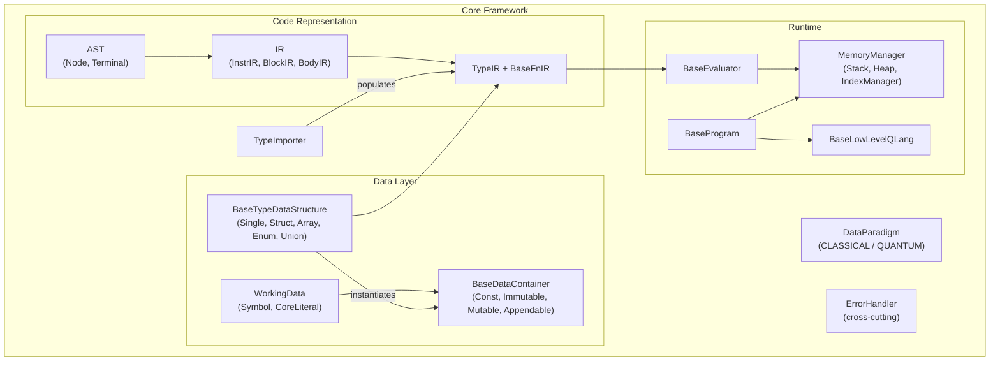

# Core

The H-hat core framework. Provides the abstract foundations, rule system, and shared infrastructure that all H-hat dialects build upon.

## Overview

H-hat is a hybrid classical-quantum programming language framework. The core module defines the contracts and primitives that any dialect must implement: how code is represented (AST, IR), how data is typed and stored (type system, variables, memory), how execution works (evaluators, quantum programs), and how errors are handled.

The fundamental design principle is the **dual-paradigm model**: all data is either classical or quantum, identified by the `DataParadigm` enum. Quantum identifiers use the `@` prefix convention (e.g., `@x`, `@true`, `@u3`). The core enforces that quantum types can contain classical members, but classical types cannot contain quantum members.

## Design Principles

**Why two paradigms?** Quantum computation requires fundamentally different handling than classical computation -- qubits can't be freely copied (no-cloning theorem), measurement is destructive, and operations accumulate as instruction sequences rather than producing immediate values. By making the paradigm distinction first-class, H-hat lets the compiler and runtime route data through the correct execution path automatically.

**The containment rule** (`check_quantum_type_correctness` in `code/utils.py`) exists because quantum data requires special resource management (qubit allocation, measurement). Classical containers have no mechanism for this, so allowing quantum members inside classical types would lose track of qubit lifecycle. The reverse -- classical data inside quantum types -- is safe because classical values are freely copyable.

**Error propagation**: The codebase uses two complementary strategies. Functions that validate inputs (type checks, index bounds) return `ErrorHandler` instances instead of raising them. This lets callers inspect errors without stack unwinding. The `Result`/`Ok`/`Error` types in `utils.py` formalize this pattern for instruction execution. Exceptions are reserved for actual programming errors (missing implementations, violated invariants).

## Directory Structure

```
core/
  __init__.py         # DataParadigm enum (CLASSICAL / QUANTUM)
  namespace.py        # Namespace and FullName for qualified identifiers
  utils.py            # SymbolOrdered dict, Result/Ok/Error pattern
  code/               # AST, IR, and instruction abstractions
  data/               # Data primitives (Symbol, CoreLiteral) and variable containers
  error_handlers/     # ErrorCodes enum and 20+ concrete error classes
  execution/          # BaseEvaluator and BaseProgram ABCs
  imports/            # TypeImporter for resolving type definitions
  lowlevel/           # BaseLowLevelQLang ABC for quantum language backends
  memory/             # IndexManager, Stack, Heap, MemoryManager
  types/              # Type system (data structures, built-in types, size resolution)
```

## Top-Level Files

### `__init__.py`

**`DataParadigm`** -- `StrEnum` with two values: `CLASSICAL` and `QUANTUM`. This is the most fundamental type in H-hat -- it classifies every piece of data, every instruction, and every type as belonging to one of these two paradigms.

### namespace.py

**`Namespace`** -- Tuple-based hierarchical namespace (e.g., `("math", "linear")`). Supports containment checks.

**`FullName`** -- Combines a `Namespace` with a single `name` string for fully-qualified identifiers (e.g., `math.linear.Vector`).

### utils.py

**`SymbolOrdered`** -- An `OrderedDict` wrapper that accepts `Symbol`, `CompositeSymbol`, `WorkingData`, `str`, or `int` as keys, automatically converting strings to `Symbol` objects. Used throughout the type system and variable containers for ordered member storage.

**`Result`** / **`Ok`** / **`Error`** -- Monadic error pattern for instruction execution. `Ok` wraps a successful value; `Error` wraps an `ErrorHandler`. Callers inspect the result type instead of catching exceptions, enabling error propagation without stack unwinding.

## Sub-Packages

| Package | Purpose | Details |
|---------|---------|---------|
| [`code/`](code/) | AST nodes, IR building blocks, instruction base classes | [README](code/README.md) |
| [`data/`](data/) | Symbol/Literal primitives, variable containers with ownership | [README](data/README.md) |
| [`error_handlers/`](error_handlers/) | Structured error codes and error classes | [README](error_handlers/README.md) |
| [`execution/`](execution/) | Abstract evaluator and quantum program bases | [README](execution/README.md) |
| [`imports/`](imports/) | Type definition resolution from `.hat` files | [README](imports/README.md) |
| [`lowlevel/`](lowlevel/) | Abstract interface for quantum language backends | [README](lowlevel/README.md) |
| [`memory/`](memory/) | Runtime memory management (indexes, stack, heap) | [README](memory/README.md) |
| [`types/`](types/) | Type data structures, built-in types, size resolution | [README](types/README.md) |

## Architecture



## Connections to Other Modules

- **[`../dialects/heather/`](../dialects/heather/)**: The reference dialect. Implements concrete AST nodes, IR builders, parser, evaluator, and quantum program using core's abstract bases.
- **[`../low_level/`](../low_level/)**: Implements `BaseLowLevelQLang` for specific quantum languages (OpenQASM v2) and target backends (Qiskit).
- **[`../toolchain/`](../toolchain/)**: CLI and project management. Uses the dialect's parser to execute H-hat code.

## Current Status

The core framework's abstract contracts and shared infrastructure are solidly defined. Key implementations: `SymbolOrdered`, `MemoryManager` (with `IndexManager`, `Stack`, `Heap`), `TypeIR`, `BodyIR`, `ErrorHandler` hierarchy, `TypeImporter`, and all built-in types. Stubs remaining: `PIDManager`, `SymbolTable`, some size resolvers, and `borrow`/`transfer` semantics on variable containers.
