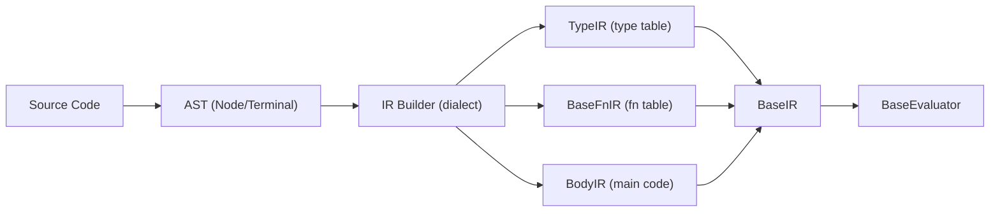

# Code

Abstract representations for AST nodes, intermediate representation (IR), and instruction base classes. Dialects implement concrete versions of these abstractions to define their syntax and compilation pipeline.

## Overview

This module provides the scaffolding that connects parsing to execution. The `AST` classes represent parsed source code as a tree, the instruction classes (`QInstr`, `CInstr`) define callable quantum and classical operations, and the IR classes (`InstrIR`, `BlockIR`, `BodyIR`, `TypeIR`, `BaseFnIR`, `BaseIR`) organize compiled code into a form the evaluator can execute.

## Directory Structure

```
code/
  __init__.py
  ast.py            # AST abstract base classes (AST, Node, Terminal)
  instructions.py   # Instruction ABCs (BaseInstr, QInstr, CInstr)
  ir.py             # IR building blocks, type/function tables, BaseIR
  utils.py          # InstrStatus enum, quantum type correctness check
```

## Module Details

### ast.py

**`AST`** (ABC) -- Base for all syntax tree nodes. Has `name` (str) and `value` (tuple of strings, child ASTs, or nested tuples). Supports iteration, hashing, and equality. Two concrete subclasses:

- **`Node(AST)`** -- Non-terminal (interior) nodes. Repr shows `Name(child1 child2 ...)`.
- **`Terminal(AST)`** -- Leaf nodes representing tokens. Repr shows the token value directly.

Dialects extend these to define their specific syntax nodes (e.g., Heather defines `Id`, `Literal`, `FnDef`, `TypeDef`, `Program`, etc. in [`../../dialects/heather/code/ast.py`](../../dialects/heather/code/ast.py)).

### instructions.py

**`QInstrFlag`** -- Enum for special instruction behavior. `NONE` (default) and `SKIP_GEN_ARGS` (tells the low-level backend to skip standard argument generation). This flag exists because some instructions -- like `@nez` (not-equal-zero conditional) -- need to interpret their arguments in a custom way rather than having the backend generate code for each argument independently. When the backend's `gen_instrs()` encounters an instruction with `SKIP_GEN_ARGS`, it passes the raw arguments directly to the instruction class and lets it handle code generation internally.

**`BaseInstr`** (ABC) -- Base instruction with `status` (InstrStatus), abstract `is_quantum`, `paradigm`, and `__call__()`. Two branches:

- **`QInstr(BaseInstr)`** -- Quantum instruction base. `is_quantum` returns `True`, `paradigm` returns `DataParadigm.QUANTUM`. Has a `flag` attribute and `skip_gen_args` property.
- **`CInstr(BaseInstr)`** -- Classical instruction base. `is_quantum` returns `False`, `paradigm` returns `DataParadigm.CLASSICAL`.

Concrete instructions live in the low-level backends (e.g., `QRedim`, `QSync`, `QNot` in [`../../low_level/quantum_lang/openqasm/v2/instructions.py`](../../low_level/quantum_lang/openqasm/v2/instructions.py)).

### ir.py

Flag enums:
- **`BlockIRFlag`** -- `INSTR_BLOCK`, `CONTROLFLOW_BLOCK`, `CLOSURE_BLOCK`, `CALL_BLOCK`
- **`InstrIRFlag`** -- `ASSIGN`, `DECLARE`, `DECLARE_ASSIGN`, `CALL`, `CONTROLFLOW`, `TEST_COND`, `LOOP`, `LOOP_COND`, `RETURN`

IR building blocks (ABCs):
- **`InstrIR`** -- Single instruction: `name` (Symbol/CompositeSymbol), `args` (ArgsIR), `flag` (InstrIRFlag)
- **`BlockIR`** -- Ordered collection of `InstrIR` and nested `BlockIR` items. Supports indexing and iteration.
- **`ArgsIR`** -- Instruction arguments as a tuple. Supports containment and iteration.
- **`BodyIR`** -- Mutable list of `InstrIR`/`BlockIR` items for function bodies and the main block. `push()` adds items, optionally applying a conversion function.

Type annotations:
- **`TypeTable`** -- `dict[Symbol | CompositeSymbol, BaseTypeDataStructure]` mapping type names to their definitions
- **`FnTable`** -- `dict[tuple[name, type, args], BodyIR]` mapping function signatures to bodies

IR table managers:
- **`TypeIR`** -- Stores and retrieves type definitions. Prevents duplicate type names.
- **`BaseFnIR`** (ABC) -- Abstract function table. Dialects implement how function lookup and call conventions work.
- **`BaseIR`** (ABC) -- Top-level IR container combining `TypeIR`, `BaseFnIR`, and a main `BodyIR`. Provides `add_type()`, abstract `add_fn()`, and `add_body()`.

### utils.py

- **`InstrStatus`** -- IntEnum tracking instruction lifecycle: `NOT_STARTED` -> `RUNNING` -> `DONE` (or `TIMEOUT`, `INTERRUPTED`, `ERROR`)
- **`check_quantum_type_correctness(names)`** -- Validates composite identifiers follow the rule: quantum data can contain classical members, but classical data cannot contain quantum members. Raises `ValueError` on violation.

## Architecture



## Connections

- **[`../data/`](../data/)**: `InstrIR` uses `Symbol`/`CompositeSymbol` for instruction names; `TypeTable` maps them to type definitions
- **[`../types/`](../types/)**: `TypeIR` stores `BaseTypeDataStructure` instances
- **[`../execution/`](../execution/)**: `BaseEvaluator` receives `TypeIR` and `BaseFnIR` for execution
- **Dialect implementations**: Heather's [`simple_ir_builder/ir.py`](../../dialects/heather/code/simple_ir_builder/ir.py) implements `IRInstr`, `IRBlock`, `IRArgs`, `FnIR`, `IR`

## Current Status

All abstract bases and IR container classes are fully defined. Concrete implementations live in the dialect layer.
