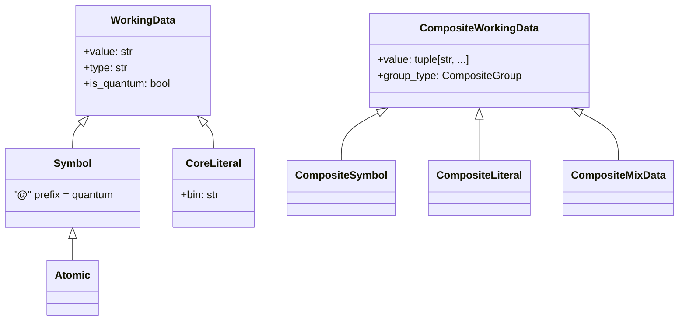

# Data

Fundamental data representation primitives for H-hat. Defines symbols, literals, composite data, and variable containers with ownership tracking.

## Overview

Every piece of data in H-hat -- variable names, function names, type names, literal values -- flows through the classes in this module. The `WorkingData` hierarchy represents atomic and composite data elements, while the `BaseDataContainer` hierarchy provides typed variable storage with mutability and quantum semantics.

A central design principle: quantum identifiers and values use the `@` prefix (e.g., `@x`, `@true`, `@42`). The module enforces that quantum and classical data cannot be inconsistently mixed.

## Directory Structure

```
data/
  __init__.py
  core.py          # WorkingData, Symbol, CoreLiteral, and composite data classes
  variable.py      # Variable containers (constant, immutable, mutable, appendable)
  utils.py         # VariableKind enum and quantum utility functions
```

## Module Details

### core.py

Defines two parallel class hierarchies for single-valued and multi-valued data:

**`WorkingData`** -- Base for anything representable as a single string value with a type. Properties: `value`, `type`, `is_quantum`. Supports comparison operators via `_op_bitwise`.

- **`Symbol(WorkingData)`** -- Names for variables, functions, types, or parameters. Quantum symbols have `@`-prefixed values. Type display is suppressed in repr.
- **`Atomic(Symbol)`** -- Marker subclass for atomic data.
- **`CoreLiteral(WorkingData)`** -- Typed literal values (e.g., `"42"` of type `"int"`). Validates quantum/classical consistency between value and type at construction. Provides a `bin` property with the binary representation.

**`CompositeWorkingData`** -- Base for grouped data (tuples of strings). Has a `group_type` (`CompositeGroup.SymbolAttrs` or `CompositeGroup.Array`).

- **`CompositeSymbol(CompositeWorkingData)`** -- Dotted identifiers like `module.function` or `namespace.type`.
- **`CompositeLiteral(CompositeWorkingData)`** -- Arrays of literals.
- **`CompositeMixData(CompositeWorkingData)`** -- Mixed arrays containing both literals and variables.

`ACCEPTABLE_VALUES` maps type names to accepted Python types for validation (e.g., `"int" -> (int,)`, `"str" -> (str,)`).



### variable.py

**`BaseDataContainer`** (ABC) -- Abstract variable/constant container. Stores data in a `SymbolOrdered` dict. Tracks ownership state via `_borrowed` and `_transferred` flags. Provides `assign()`, `get()`, `borrow()`, `transfer()`, and `free()` methods. An `_instr_counter` tracks instruction ordering for quantum variables.

**`VariableTemplate`** -- Factory (implemented via `__new__`) that creates the appropriate container based on `VariableKind` and quantum status:
- Quantum variables always become `AppendableVariable` (they accumulate instructions)
- Classical variables dispatch on the `VariableKind` flag
- Mismatched quantum/classical name+type returns `VariableCreationError`

Four concrete container types:

| Class | Mutable | Quantum | Reassign |
|-------|---------|---------|----------|
| `ConstantData` | No | No | Never |
| `ImmutableVariable` | No | No | Once only |
| `MutableVariable` | Yes | No | Any time |
| `AppendableVariable` | Yes | Yes/No | Accumulates |

**Why quantum variables are always appendable**: Quantum operations don't produce immediate values -- they build up instruction sequences that are later compiled into a quantum circuit. Each `@redim`, `@sync`, or `@not` call appends to the variable's instruction list rather than replacing its content. This is why `VariableTemplate` always creates `AppendableVariable` for quantum data, regardless of the `VariableKind` requested.

**Ownership semantics**: `BaseDataContainer` tracks `_borrowed` and `_transferred` flags, inspired by Rust-style ownership. A variable that has been transferred cannot be read (its data moved to another scope). A variable that is borrowed elsewhere cannot be freed. These checks are defined in `free()` (raises `VariableFreeingBorrowedError` if borrowed) and `get()`. Note: `borrow()` and `transfer()` are not yet implemented on concrete types -- they raise `NotImplementedError`.

### utils.py

- **`VariableKind`** -- Enum: `CONSTANT`, `IMMUTABLE`, `MUTABLE`, `APPENDABLE`
- **`isquantum(data)`** -- Checks if data is quantum (string starts with `@` or has `is_quantum` attribute)
- **`has_same_paradigm(data1, data2)`** -- Returns `True` if both are quantum or both are classical

## Connections

- **Used by [`../types/`](../types/)**: Type data structures use `VariableTemplate` to instantiate variables from type definitions
- **Used by [`../memory/`](../memory/)**: `Heap` stores `BaseDataContainer` instances keyed by `Symbol`
- **Used by [`../code/ir.py`](../code/ir.py)**: `TypeTable` maps `Symbol`/`CompositeSymbol` to type definitions
- **Used by dialects**: IR builders convert dialect-specific AST nodes into `Symbol`, `CompositeSymbol`, and `CoreLiteral`

## Current Status

Core data classes and variable containers are implemented. `borrow()` and `transfer()` raise `NotImplementedError` in all concrete container types. `ConstantData.assign()` also raises `NotImplementedError`.
