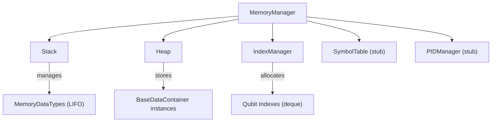

# Memory

Runtime memory management for H-hat programs. Handles qubit index allocation, stack operations, heap variable storage, and coordinates these through a unified memory manager.

## Overview

H-hat programs need to manage both classical data (stored on heap) and quantum resources (tracked by index allocation). The `MemoryManager` facade combines all memory subsystems into a single object that evaluators receive at construction time.

## Directory Structure

```
memory/
  __init__.py
  core.py       # IndexManager, Stack, Heap, MemoryManager, and supporting classes
```

## Module Details

### core.py

**`IndexManager`** -- Manages qubit index allocation. Maintains a pool of available indexes (deque) and tracks which variables hold which indexes. Key lifecycle:

1. `add(var_name, num_idxs)` -- Register a variable's qubit requirement
2. `request(var_name)` -- Allocate indexes from the pool for the registered variable
3. `free(var_name)` -- Release indexes back to the pool

Properties: `max_number` (capacity), `available` (unallocated indexes), `allocated` (in-use indexes), `resources` (registered variable -> count), `in_use_by` (variable -> allocated index deque).

Returns specific errors on failure: `IndexAllocationError` (not enough indexes), `IndexVarHasIndexesError` (variable already registered), `IndexInvalidVarError` (variable not found).

**`BaseStack`** / **`Stack`** -- LIFO queue (wraps `LifoQueue`). Methods: `push()`, `pop()`, `peek()`. Used by evaluators during instruction execution and by the quantum branch as a quantum stack. Note: `peek()` is documented as an "expensive method" -- it pops the item and pushes it back (get-then-put pattern), so avoid calling it in tight loops.

**`BaseHeap`** / **`Heap`** -- Dictionary-based storage mapping `Symbol` keys to `BaseDataContainer` values. Methods: `set()`, `get()`. Validates that keys are `Symbol` and values are `BaseDataContainer`, returning `HeapInvalidKeyError` on type mismatch.

**`SymbolTable`** -- Intended for storing types and functions. Currently a stub.

**`PIDManager`** -- Process ID management. Currently a stub (methods raise `NotImplementedError`).

**`MemoryManager`** -- Facade combining all memory subsystems. Constructed with `max_num_index` to set qubit capacity. Properties: `stack`, `heap`, `symboltable`, `idx` (IndexManager).

**`MemoryDataTypes`** -- Type alias for values that can be stored in memory: `BaseDataContainer | CoreLiteral | CompositeLiteral | Symbol | CompositeMixData`.



## Connections

- **[`../execution/`](../execution/)**: `BaseEvaluator` holds a `MemoryManager` instance
- **[`../data/`](../data/)**: `Heap` stores `BaseDataContainer` instances; `IndexManager` tracks `WorkingData` variable registrations
- **[`../lowlevel/`](../lowlevel/)**: `BaseLowLevelQLang` uses `IndexManager` and `BaseStack` for quantum resource tracking
- **Dialect executors**: Both the classical evaluator and quantum program in Heather operate on the memory manager

## Current Status

`IndexManager`, `Stack`, `Heap`, and `MemoryManager` are fully implemented. `PIDManager` and `SymbolTable` are stubs. `Heap` does not yet support scope-based storage -- there are TODOs in `BaseHeap` and `Heap` to add scope-aware variable lifetime management, which will be needed for function calls and closures.
