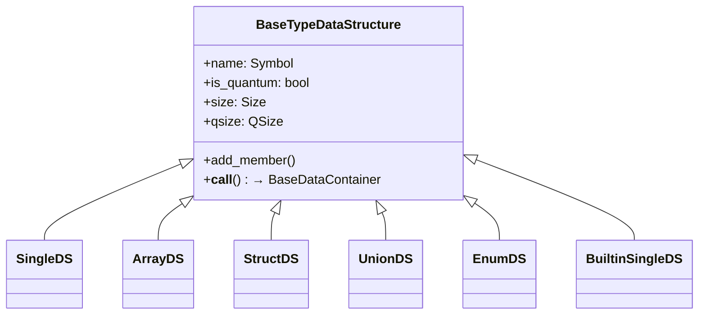

# Types

The H-hat type system. Defines abstract type data structures, built-in classical and quantum types, and size resolution utilities.

## Overview

H-hat types define how data is structured, how variables are instantiated from type definitions, and how many qubits a quantum type requires. The type system enforces the core rule: quantum types can contain classical members, but classical types cannot contain quantum members.

Types are registered in a `TypeIR` table (from [`../code/ir.py`](../code/ir.py)) and are used to create variable containers via `VariableTemplate` (from [`../data/variable.py`](../data/variable.py)).

## Directory Structure

```
types/
  __init__.py          # POINTER_SIZE = 32 constant
  abstract_base.py     # BaseTypeDataStructure, Size, QSize
  core.py              # SingleDS, ArrayDS, StructDS, UnionDS, EnumDS
  builtin_base.py      # BuiltinSingleDS, cast functions, symbol constants
  builtin_types.py     # Built-in type instances (Int, Bool, U32, QBool, QU3, etc.)
  resolve_sizes.py     # Size resolution utilities
```

## Module Details

### abstract_base.py

**`Size`** -- Wrapper for classical bit-size information (e.g., `Size(32)` for a 32-bit type).

**`QSize`** -- Quantum size as qubit count. Has `min` (minimum qubits) and optional `max` (maximum qubits, computed recursively for composite types by `_qsize_resolver()`). The min/max range exists because composite quantum types may have variable qubit requirements depending on member initialization -- `min` is the base requirement, `max` sums all possible member contributions. Does not account for ancilla qubits that low-level backends may add.

**`BaseTypeDataStructure`** (ABC) -- Base for all type definitions. Properties: `name`, `is_quantum`, `is_builtin`, `size`, `qsize`, `is_array`, `members`. Uses a `SymbolOrdered` type container to store member definitions.

Key abstract methods:
- `add_member()` -- Register a member type (and optionally a name for struct members)
- `__call__()` -- Instantiate a variable of this type using `VariableTemplate`

### core.py

Five concrete data structures:

| Class | Description | Members | Status |
|-------|-------------|---------|--------|
| `SingleDS` | Single-member type (e.g., a newtype wrapper) | One member type | Implemented |
| `StructDS` | Struct with named members | Multiple name-type pairs | Implemented |
| `ArrayDS` | Array type (e.g., `[u64]`) | Element type | Stub |
| `UnionDS` | Union type | Multiple member types | Stub |
| `EnumDS` | Enum with variants | Variant definitions | Stub |

`is_valid_member()` validates that classical types don't contain quantum members.

`SingleDS.__call__()` and `StructDS.__call__()` create variable instances: they build a `SymbolOrdered` layout, pass it to `VariableTemplate`, and assign initial values.

### builtin_base.py

**`BuiltinSingleDS`** -- Built-in primitive type. Stores its name directly in `_type_container[0]`. Has `bitsize` property and `cast_from()` method for type casting.

**Symbol constants** for type names:
- Classical: `S_INT`, `S_BOOL`, `S_U16`, `S_U32`, `S_U64`
- Quantum: `S_QINT`, `S_QBOOL`, `S_QU2`, `S_QU3`, `S_QU4`

**`int_to_uN()`** -- Cast function for integer-to-unsigned conversion. Validates against negative values and overflow for the target bit width. Returns `CastNegToUnsignedError` or `CastIntOverflowError` on failure.

### builtin_types.py

Instantiates all built-in types. The `POINTER_SIZE` constant (currently 32 bits, defined in `__init__.py`) is used for the classical `Size` of all quantum types. This is because a quantum variable's classical representation is just a pointer/reference to its qubit indexes -- the actual data lives in the qubits themselves, not in classical memory.

| Instance | Symbol | Size | QSize |
|----------|--------|------|-------|
| `Int` | `int` | None | -- |
| `Bool` | `bool` | 8 bits | -- |
| `U16` | `u16` | 16 bits | -- |
| `U32` | `u32` | 32 bits | -- |
| `U64` | `u64` | 64 bits | -- |
| `QBool` | `@bool` | POINTER_SIZE | 1 qubit |
| `QU2` | `@u2` | POINTER_SIZE | 2 qubits |
| `QU3` | `@u3` | POINTER_SIZE | 3 qubits |
| `QU4` | `@u4` | POINTER_SIZE | 4 qubits |

Quantum types use `POINTER_SIZE` (32 bits) for their classical bit representation, since the actual data lives in qubits.

### resolve_sizes.py

**`_qsize_resolver()`** -- Recursively computes the maximum quantum size for composite types by summing member qsizes through the `TypeTable`. Used at compile time to determine total qubit requirements.

Stub functions for future implementation: `ct_size()`, `ct_qsize()`, `runtime_size()`, `runtime_qsize()`.

## Architecture



## Connections

- **[`../data/variable.py`](../data/variable.py)**: `__call__()` on type data structures creates variables via `VariableTemplate`
- **[`../code/ir.py`](../code/ir.py)**: `TypeIR` stores type definitions as `dict[Symbol, BaseTypeDataStructure]`
- **[`../error_handlers/`](../error_handlers/)**: Type validation returns `TypeQuantumOnClassicalError`, `TypeAndMemberNoMatchError`, `TypeSingleError`, `TypeStructError`
- **[`../imports/`](../imports/)**: `TypeImporter` resolves type names that get registered here

## Current Status

`SingleDS`, `StructDS`, and `BuiltinSingleDS` are implemented with full member validation and variable instantiation. `ArrayDS`, `UnionDS`, and `EnumDS` raise `NotImplementedError`. Size resolution is partially implemented (`_qsize_resolver` works; compile-time and runtime resolvers are stubs).
