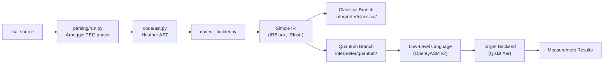

# Heather, a H-hat dialect

Heather is a simple dialect created to demonstrate H-hat concepts, functionalities, capabilities and
usage. Its core goals are:

1. Introduce H-hat paradigm to programmers new to it,
2. Present H-hat rules system in a practical and applied sense,
3. Spark interest in programmers to implement their own H-hat dialects with new functionalities, new
   syntax or new concepts, as long as they follow H-hat rules system.

## How to use it

### With Python

You can import it in your python script/notebook as `hhat_heather` package.

### With Heather CLI

To evaluate a H-hat code inside a `.hat` file, use: [*in progress*]

### With Heather REPL

> [!NOTE]
>
> In progress.

## Directory Structure

```
heather/
  __init__.py
  README.md
  code/                    # AST definitions and IR builders
    ast.py                 # 38 Heather-specific AST node classes
    ir_builder.py          # AST -> IR conversion orchestrator
    simple_ir_builder/     # Direct IR for the interpreter
    ssa_ir_builder/        # SSA form IR for optimization (future)
    mlir_builder/          # MLIR target (stub)
  grammar/                 # Syntax definition
    grammar.peg            # PEG grammar processed by Arpeggio
  parsing/                 # Source code parsing
    run.py                 # parse() and parse_file() entry points
    visitor.py             # Parse tree -> AST visitor
    imports.py             # Type/function import resolution
  interpreter/             # Code execution
    executor.py            # Top-level evaluator
    classical/executor.py  # Classical branch evaluator
    quantum/program.py     # Quantum program execution
  toolchain/               # Dialect-specific tooling
    notebooks/             # Jupyter integration (future)
    pygments/              # Syntax highlighting (future)
```

See individual README files in each subdirectory for detailed documentation:
[`code/`](code/README.md) | [`grammar/`](grammar/README.md) | [`parsing/`](parsing/README.md) | [`interpreter/`](interpreter/README.md)

## Compilation and Execution Pipeline



## Creating a New Dialect

Heather serves as the reference implementation for H-hat dialects. To create a new dialect, you need:

1. **`grammar/`** -- A PEG grammar file defining your syntax
2. **`parsing/`** -- An Arpeggio visitor converting parse trees to AST nodes (extending core's `Node`/`Terminal`)
3. **`code/`** -- AST node classes and an IR builder producing `InstrIR`/`BlockIR`/`BodyIR` instances
4. **`interpreter/`** -- Concrete `BaseEvaluator` (classical) and `BaseProgram` (quantum) implementations

Any dialect must follow H-hat's rules system: dual-paradigm classification, `@` prefix for quantum identifiers, and the containment rule (quantum can contain classical, but not the reverse).

## Current Status

- **Parsing**: Types (single, struct, enum), imports, identifiers, modifiers, and all literal types work. Function call and array parsing are not yet implemented.
- **IR Building**: `simple_ir_builder` is functional. SSA IR has data structures defined but is not integrated. MLIR is a stub.
- **Execution**: Quantum program path works end-to-end (IR -> OpenQASM v2 -> Qiskit Aer -> results). Classical evaluator is a stub.
- **Toolchain**: Notebooks and Pygments syntax highlighting are placeholders.
