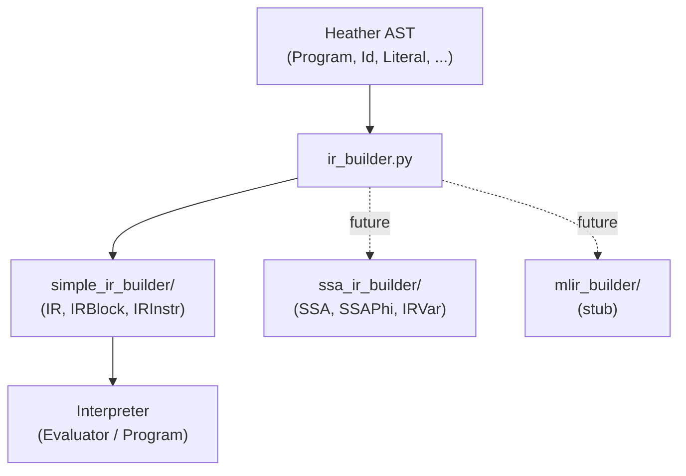

# Code

Heather-specific AST node definitions and multiple IR builder implementations for converting parsed code into executable intermediate representation.

## Overview

This module defines the full AST vocabulary for Heather (38 node classes), the IR builder that converts AST nodes into core data structures, and three IR backend strategies: a simple IR for the interpreter, an SSA (Static Single Assignment) form IR for future optimization passes, and an MLIR stub for future LLVM integration.

## Directory Structure

```
code/
  __init__.py
  ast.py                      # 38 Heather-specific AST node classes
  ir_builder.py               # Orchestrates AST -> IR conversion
  simple_ir_builder/          # Simple (direct) IR implementation
    __init__.py
    builder.py                # AST-to-core-data conversion functions
    ir.py                     # IRInstr, IRBlock, IRArgs, FnIR, IR classes
  ssa_ir_builder/             # SSA form IR for optimization
    __init__.py
    ir.py                     # SSACounter, SSA, SSAPhi, IRModifier, IRVar
  mlir_builder/               # MLIR target (future)
    __init__.py
    ir.py                     # Stub only
```

## Module Details

### ast.py

Defines the Heather AST node classes, organized by category:

**Identifiers**: `Id` (simple name), `CompositeId` (dotted name like `module.fn`), `CompositeIdWithClosure` (grouped access like `math.{add sub}`), `ModifiedId` (identifier with angle-bracket modifier)

**Literals**: `Literal` (typed literal with value and type strings), `CompositeLiteral` (array of literals)

**Declarations**: `Declare` (type annotation without value), `Assign` (value assignment), `DeclareAssign` (combined annotation + assignment)

**Function calls**: `Call`, `CallArgs`, `CallWithBody` (call with closure), `CallWithBodyOptions`, `CallWithArgsBodyOptions`, `MethodCall`, `MethodCallArgs`, `InsideOption`

**Arguments**: `ArgValuePair` (named arg: value), `OnlyValue` (positional value), `ArgTypePair` (typed arg definition)

**Type definitions**: `TypeDef`, `TypeMember` (named struct member), `SingleTypeMember`, `EnumTypeMember`

**Imports**: `Imports` (container), `TypeImport`, `FnImport`, `ManyTypeImport`

**Structure**: `Modifier`, `Cast`, `Array`, `Hash`, `Expr`, `Body`, `Main`, `FnDef`, `FnArgs`, `Program` (root node)

**Type aliases**: `ValueType`, `TypeType`, `BodyType` for type hinting.

### ir_builder.py

Orchestrates AST-to-IR conversion in three sections:

1. **Building functions** (`_build_id`, `_build_compositeid`, `_build_literal`, `_build_argvaluepair`, `_build_onlyvalue`, `_build_modifier`, `_build_valuetype`, `_build_typetype`, `_build_bodytype`) -- Convert AST nodes into core `Symbol`, `CompositeSymbol`, and `CoreLiteral` objects. Some (like `_build_id`, `_build_literal`, `_build_argvaluepair`) delegate to real implementations in `simple_ir_builder/builder.py`. Others (arrays, hashes, expressions, assignments, function/method calls) are stubs.

2. **Table builders** (`build_typetable`, `build_fntable`) -- Build type and function tables from AST type/function definitions. `build_fntable` extracts function name, return type, arguments, and body.

3. **Main code** (`build_main`) -- Processes the `Program` root node, dispatching on `Imports`, `Body`, `Main`, and `Program` nodes. Calls `parse_imports()` for import resolution.

### simple_ir_builder/

**builder.py** -- Functions that convert AST nodes to core data objects:
- `define_id(Id) -> Symbol`
- `define_compositeid(CompositeId) -> CompositeSymbol` (with quantum correctness check)
- `define_literal(Literal) -> CoreLiteral`
- `define_argvaluepair(ArgValuePair) -> tuple[Symbol, Any]`
- `define_valuetype(ValueType) -> Symbol | CompositeSymbol | CoreLiteral`

**ir.py** -- Concrete IR classes implementing core ABCs:
- `IRInstr(InstrIR)` -- Instruction with name, args, flag
- `IRArgs(ArgsIR)` -- Argument container
- `IRBlock(BlockIR)` -- Block with UUID name and `add_instr()` method
- `FnIR(BaseFnIR)` -- Function table implementation
- `IR(BaseIR)` -- Top-level IR container with `add_fn()` implementation

### ssa_ir_builder/

**ir.py** -- SSA form data structures for future optimization passes:
- `SSACounter` -- Manages auto-incrementing version numbers for SSA values. Counter starts at -1 to align with list indexes (first `next()` call returns 0).
- `SSA` -- Represents a single SSA assignment (symbol + version index). Supports optional `SSAPhi` and `IRModifier`.
- `SSAPhi` -- Phi function for merging values at control flow join points. Validates that all arguments reference the same variable.
- `IRModifier` -- Attaches behavioral modifiers to SSA values (positional or key-value)
- `IRVar` -- Tracks all SSA versions of a single variable (list of `SSA` instances)

### mlir_builder/

**ir.py** -- Contains a single `define_id` stub. Placeholder for future MLIR (Multi-Level IR) integration with LLVM-based backends.



## Connections

- **[`../parsing/`](../parsing/)**: Produces the AST that `ir_builder.py` consumes
- **[`hhat_lang.core.code`](../../../core/code/)**: Provides the ABCs that simple_ir_builder implements (InstrIR, BlockIR, ArgsIR, BaseFnIR, BaseIR)
- **[`hhat_lang.core.data`](../../../core/data/)**: `Symbol`, `CompositeSymbol`, `CoreLiteral` produced by the builder functions
- **[`../interpreter/`](../interpreter/)**: Consumes the IR for execution

## Current Status

`simple_ir_builder` is the most complete IR backend -- `IRInstr`, `IRBlock`, `IRArgs`, `FnIR`, and `IR` are all implemented. `ssa_ir_builder` has the SSA data structures defined but is not yet integrated into `ir_builder.py`. `mlir_builder` is a stub. Many `_build_*` functions in `ir_builder.py` are stubs (arrays, hashes, expressions, assignments, function/method calls).

The IR backend is intended to be swappable -- `ir_builder.py` has a TODO to support selecting which backend (simple, SSA, MLIR) to use via a project configuration file, rather than the current hardcoded `simple_ir_builder` import.
