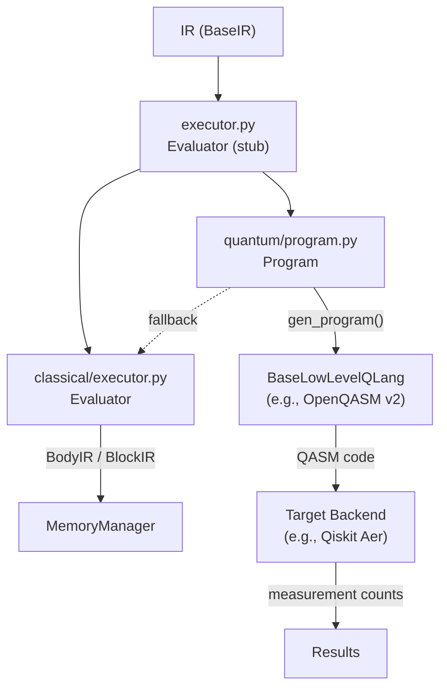

# Interpreter

Executes Heather IR code through a dual-branch architecture: classical instructions run directly via an evaluator, quantum instructions are compiled to a low-level quantum language and executed on a target backend.

## Overview

H-hat's execution model splits IR code into two branches based on the data paradigm. The classical branch evaluates standard operations using memory, types, and function tables. The quantum branch generates low-level quantum code (e.g., OpenQASM), executes it on a target backend (e.g., Qiskit Aer simulator), and casts the results back to the requested classical type.

The execution pipeline (from `__init__.py`):

```
raw code -> AST -> IR
              _______|__________
             |                  |
             v                  v
       quantum branch      classical branch
             |                  |-> memory
             |                  |-> executor
             |-> program
             |-> executor
                     | -> low level language
                     | -> target (simulator or QPU device)
                     | -> classical branch (if needed)
```

## Directory Structure

```
interpreter/
  __init__.py                  # Execution pipeline documentation
  executor.py                  # Top-level Evaluator (accepts full IR)
  classical/
    __init__.py
    executor.py                # Classical branch Evaluator (BaseEvaluator impl)
  quantum/
    __init__.py
    program.py                 # Quantum Program (BaseProgram impl)
```

## Module Details

### executor.py

**`Evaluator`** -- Top-level evaluator that accepts a `BaseIR` instance. Validates the input type at construction. Has `walk()` and `run()` methods -- both are currently stubs. Intended to orchestrate the branching between classical and quantum execution paths.

### classical/executor.py

**`Evaluator(BaseEvaluator)`** -- Classical branch evaluator. Constructed with:
- `mem` -- `MemoryManager` for variable storage, stack, and heap operations
- `type_table` -- `TypeIR` with all registered type definitions
- `fn_table` -- `BaseFnIR` with all registered function definitions

Methods `run(code: BodyIR | BlockIR)` and `__call__(code: BodyIR | BlockIR)` are stubs. This evaluator is also used as a fallback by the quantum branch for instructions that the low-level language or target backend doesn't support.

### quantum/program.py

**`Program(BaseProgram)`** -- The most complete execution component. Handles quantum data execution and casting between quantum and classical types.

Constructed with (keyword-only arguments):
- `qdata` -- The quantum variable (`WorkingData`) being processed
- `idx` -- `IndexManager` for qubit allocation tracking
- `block` -- `IRBlock` containing the quantum instructions
- `executor` -- `BaseEvaluator` for classical fallback
- `qlang` -- A `BaseLowLevelQLang` class (not instance) to generate low-level code

The constructor instantiates the low-level language with the quantum data, IR block, index manager, evaluator, and a fresh `Stack` for the quantum execution context.

**`run(debug=False)`**:
1. Calls `self._qlang.gen_program()` to produce the complete low-level code (e.g., an OpenQASM v2 program string)
2. If `debug`, prints the generated code
3. Calls `execute_program()` from the target backend to run the circuit and return measurement results

Example quantum casting workflows:
```
u32*@2              // cast quantum literal @2 to u32
u32*@redim(@1<@u3>) // cast quantum operation result to u32
@v1:@u3 = @redim(@0)
number:u32 = u32*@v1  // cast quantum variable to u32
```

> **Note**: The target backend import (`qiskit.openqasm.code_executor`) is currently hardcoded. This should be driven by project configuration.



## Connections

- **[`../code/`](../code/)**: Provides the IR that the interpreter executes
- **[`hhat_lang.core.execution`](../../../core/execution/)**: `BaseEvaluator` and `BaseProgram` ABCs that the classical executor and quantum program implement
- **[`hhat_lang.core.memory`](../../../core/memory/)**: `MemoryManager`, `IndexManager`, `Stack` used by both branches
- **[`hhat_lang.low_level`](../../../low_level/)**: OpenQASM v2 backend (`LowLeveQLang`) and Qiskit execution (`execute_program`)

## Design Notes

**Stack ordering for control flow**: Instructions that consume multiple arguments from the stack (like `if`) expect a specific push order. For `If`, the condition is pushed first and the instruction body second. Since the stack is LIFO, pops retrieve them in reverse: body first, then condition. Getting this order wrong causes silent misinterpretation. See the `If` instruction in `low_level/quantum_lang/openqasm/v2/instructions.py` for the canonical example.

**Quantum program workflow** (documented in `program.py`):
1. Instructions are analyzed against what the low-level language and target backend support
2. Unsupported classical instructions fall back to the dialect's classical evaluator
3. Memory is managed by the dialect but shared with low-level counterparts
4. Quantum optimizations are handled by the low-level compiler (future)
5. Quantum instructions are executed, and casting protocols convert results from quantum to classical types

## Current Status

The quantum program execution path works end-to-end: IR -> OpenQASM v2 code generation -> Qiskit Aer simulation -> measurement results. The top-level evaluator and classical branch evaluator are stubs (`run()` and `__call__()` are no-ops).
