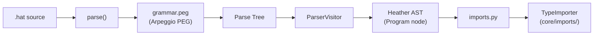

# Parsing

Parses Heather `.hat` source code into AST nodes using the Arpeggio PEG parser, and handles import resolution.

## Overview

This module is the entry point for transforming raw Heather source code into an abstract syntax tree. The pipeline is: read grammar -> create parser -> parse source -> visit parse tree -> produce AST. A separate import resolution step handles `use(type: ...)` statements by locating and loading type definitions from the project's `hat_types/` directory.

## Directory Structure

```
parsing/
  __init__.py
  run.py          # Parser instantiation and entry points (parse, parse_file)
  visitor.py      # ParserVisitor: parse tree -> Heather AST conversion
  imports.py      # Import resolution for types and functions
```

## Module Details

### run.py

Entry point functions for the parsing pipeline:

- **`read_grammar()`** -- Loads `grammar.peg` from the grammar directory. Raises `ValueError` if not found.
- **`parse_grammar()`** -- Creates an Arpeggio `ParserPEG` with root rule `program`, comment rule `comment`, `reduce_tree=False`, and `ws=WHITESPACE` (Heather's whitespace characters). The `reduce_tree=False` setting is important: it preserves the full parse tree structure rather than collapsing single-child nodes. This gives the visitor deterministic node structures to pattern-match against, at the cost of more verbose tree traversal.
- **`parse(raw_code: str) -> AST`** -- Full pipeline: creates parser, parses the source string, then applies `ParserVisitor` via `visit_parse_tree()` to produce a Heather AST.
- **`parse_file(file: str | Path) -> AST`** -- Convenience wrapper that reads a file and calls `parse()`.

### visitor.py

**`ParserVisitor(PTNodeVisitor)`** -- Arpeggio visitor that converts each grammar rule match into a Heather AST node. Each `visit_*` method corresponds to a rule in `grammar.peg`:

| Visitor method | Produces AST node | Notes |
|---------------|-------------------|-------|
| `visit_program` | `Program` | Collects imports, types, functions, main |
| `visit_imports` | `Imports` | Groups type and function imports |
| `visit_typeimport` | `TypeImport` | List of imported type identifiers |
| `visit_typesingle` | `TypeDef` + `SingleTypeMember` | Single-member type alias |
| `visit_typestruct` | `TypeDef` + `TypeMember` list | Struct with named fields |
| `visit_typeenum` | `TypeDef` + `EnumTypeMember` list | Enum with variants |
| `visit_id` | `Id` or `ModifiedId` | Identifier, with modifier if present |
| `visit_composite_id` | `CompositeId` | Dotted identifier |
| `visit_composite_id_with_closure` | `CompositeIdWithClosure` | Grouped attribute access |
| `visit_modifier` | `Modifier` | Angle-bracket modifier |
| `visit_main` | `Main` | Main entry block |
| `visit_literal`, `visit_int`, `visit_bool`, etc. | `Literal` | Typed literal values |
| `visit_q__bool`, `visit_q__int` | `Literal` | Quantum literals (`@true`, `@42`) |

**Not yet implemented** (raise `NotImplementedError`): `visit_call`, `visit_args`, `visit_callargs`, `visit_valonly`, `visit_array`, `visit_trait_id`, `visit_typeunion`.

### imports.py

Handles `use(type: ...)` import statements:

- **`parse_imports(code: Imports)`** -- Entry point. Extracts `TypeImport` entries, resolves each imported type name to a `CompositeSymbol`, then creates a `TypeImporter` instance and calls `import_types()` to recursively resolve all dependencies.
- **`parse_types(code)`** -- Dispatches on `CompositeId` or `CompositeIdWithClosure` to collect symbol lists.
- **`_collect_symbols_from_closure(obj, prefix)`** -- Recursively expands grouped import syntax (e.g., `math.{vector matrix}` becomes `[CompositeSymbol(("math", "vector")), CompositeSymbol(("math", "matrix"))]`).
- **`parse_fns(code)`** -- Function import handling (stub, not implemented).



## Connections

- **[`../grammar/`](../grammar/)**: Provides `grammar.peg` and `WHITESPACE` definition
- **[`../code/ast.py`](../code/ast.py)**: The AST node classes that the visitor produces
- **[`../code/ir_builder.py`](../code/ir_builder.py)**: Consumes the AST for IR construction
- **[`hhat_lang.core.imports`](../../../core/imports/)**: `TypeImporter` resolves transitive type dependencies

## Current Status

Parsing works for types (single, struct, enum), imports, identifiers, modifiers, and all literal types. Function call parsing, array parsing, trait identifiers, and union types are not yet implemented in the visitor.
