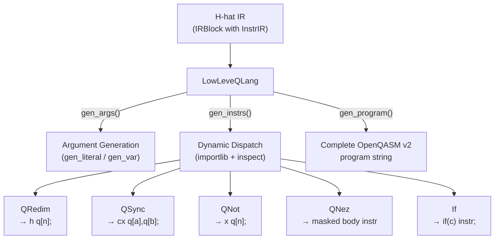

# Quantum Language Backends

Implementations of low-level quantum language backends that translate H-hat quantum instructions into specific quantum assembly languages.

## Overview

When the Heather interpreter encounters quantum instructions, it delegates code generation to a low-level quantum language backend. Each backend implements `BaseLowLevelQLang` (from [`core/lowlevel/`](../../core/lowlevel/)) and translates H-hat IR instructions into a target language (e.g., OpenQASM v2). The backend also defines the concrete quantum instruction classes that map H-hat operations to hardware-level gates.

## Directory Structure

```
quantum_lang/
  __init__.py
  openqasm/                   # OpenQASM backend
    __init__.py               # DEFAULT_HEADER constant
    v2/                       # OpenQASM v2.0 implementation
      __init__.py
      qlang.py                # LowLeveQLang class (main backend)
      instructions.py         # Instruction classes (QRedim, QSync, QNot, QNez, If)
  netqasm/                    # NetQASM backend (placeholder)
    __init__.py
```

## Module Details

### openqasm/v2/qlang.py

**`LowLeveQLang(BaseLowLevelQLang)`** -- The main OpenQASM v2.0 backend. Generates complete QASM programs from H-hat IR.

Key methods:

| Method | Purpose |
|--------|---------|
| `init_qlang()` | Returns QASM header: version declaration, `qelib1.inc` include, `qreg`/`creg` declarations |
| `end_qlang()` | Returns `measure q -> c;` measurement instruction |
| `gen_literal(literal)` | Converts a `CoreLiteral`'s binary representation to Pauli-X gates (each `1` bit becomes `x q[n];`) |
| `gen_var(var, executor)` | Recursively resolves variable data from the heap and generates code for each member (Symbol, CoreLiteral, or nested InstrIR) |
| `gen_args(args)` | Iterates over instruction arguments, dispatching each to `gen_literal`, `gen_var`, or `gen_instrs` |
| `gen_instrs(instr)` | Dynamically imports instruction classes via `inspect.getmembers()`, matches `InstrIR.name` to the class's `name` attribute, handles `SKIP_GEN_ARGS` flag for special instructions like `@nez` |
| `gen_program()` | Full pipeline: iterates IR block instructions, generates arguments and instruction code, assembles header + body + measurements into a complete QASM string |

The instruction dispatch uses Python's `importlib` and `inspect` to dynamically discover instruction classes, matching each IR instruction's name against available classes at runtime. This means adding a new instruction is purely additive -- define a new class in `instructions.py` with a matching `name` attribute, and `gen_instrs()` will find it automatically without any registration step.

### openqasm/v2/instructions.py

Concrete instruction classes that translate H-hat operations to OpenQASM v2 gate instructions:

**Classical instructions:**

| Class | H-hat name | QASM output | Description |
|-------|-----------|-------------|-------------|
| `If` | `if` | `if(cond) instr;` | Classical conditional. Pops condition and instruction from the executor's stack. |

**Quantum instructions:**

| Class | H-hat name | QASM output | Description |
|-------|-----------|-------------|-------------|
| `QRedim` | `@redim` | `h q[idx];` | Hadamard gate -- puts qubit into superposition |
| `QSync` | `@sync` | `cx q[idx0], q[idx1];` | CNOT gate -- entangles two qubits |
| `QNot` | `@not` | `x q[idx];` | Pauli-X gate -- quantum NOT |
| `QNez` | `@nez` | (varies) | Not-equal-zero conditional: applies a body instruction only to qubits where the mask has `1` bits. Uses `SKIP_GEN_ARGS` flag for custom argument handling. |
| `QIf` | `@if` | -- | Quantum conditional (stub, raises `NotImplementedError`) |

**`QNez` in detail:** This instruction takes a mask and a body instruction (e.g., `@nez(@5, @not)`). It converts the mask to binary, identifies which bit positions are `1`, selects the corresponding qubit indexes, and applies the body instruction only to those qubits. Supports `CoreLiteral`, `Symbol`, and `BaseDataContainer` as mask values, resolving variables from the executor's heap when needed.

Each instruction returns `tuple[tuple[str, ...], InstrStatus]` -- a tuple of QASM code strings and the resulting status (`DONE` or `ERROR`).

### Adding a New Instruction

1. Inherit from `QInstr` (quantum) or `CInstr` (classical) from `core/code/instructions.py`
2. Set a `name` class attribute matching the H-hat instruction name (e.g., `name = "@redim"`)
3. Implement a static `_instr()` method that returns the QASM template string
4. Implement `_translate_instrs()` for any conversion logic
5. Implement `__call__(*, idxs, executor, **kwargs)` as the main entry point
6. If your instruction needs custom argument handling instead of standard `gen_args()` processing, set `flag = QInstrFlag.SKIP_GEN_ARGS` (see `QNez` for an example)

### netqasm/

Placeholder for a future [NetQASM](https://github.com/QuTech-Delft/netqasm) backend, intended for quantum network applications. Currently contains only an empty `__init__.py`.



## Connections

- **[`../../core/lowlevel/abstract_qlang.py`](../../core/lowlevel/abstract_qlang.py)**: `BaseLowLevelQLang` ABC that `LowLeveQLang` implements
- **[`../../core/code/instructions.py`](../../core/code/instructions.py)**: `QInstr` and `CInstr` base classes for the instruction implementations
- **[`../target_backend/`](../target_backend/)**: Takes the generated QASM string and executes it on a simulator or device
- **[`../../dialects/heather/interpreter/quantum/program.py`](../../dialects/heather/interpreter/quantum/program.py)**: Creates a `LowLeveQLang` instance and calls `gen_program()`

## Current Status

OpenQASM v2 backend is functional with `@redim` (Hadamard), `@sync` (CNOT), `@not` (Pauli-X), `@nez` (masked conditional), and classical `if`. `@if` (quantum conditional) is a stub. Composite data types (`CompositeSymbol`, `CompositeLiteral`, `CompositeMixData`) in `gen_var` and `gen_args` raise `NotImplementedError`. NetQASM is a placeholder.

Open TODOs in the backend:
- `end_qlang()`: Track previously-measured qubits to avoid redundant measurement
- `gen_program()`: When an instruction isn't supported by OpenQASM v2, fall back to the dialect's classical executor instead of failing
- `@sync`: Extend beyond basic 2-qubit CX to full multi-qubit sync capabilities
- Error handling in `gen_program()` needs proper recovery beyond raising exceptions
